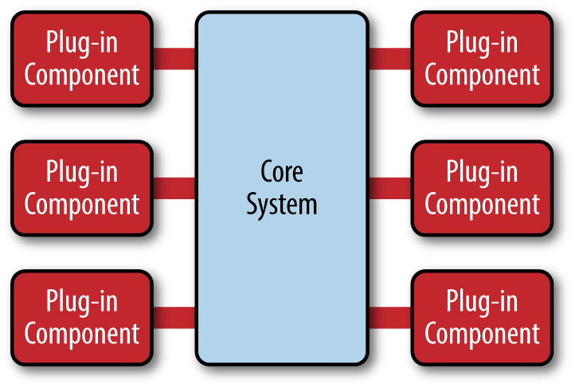

##### MicroKernel (Plug-in based)

+++

- natural pattern for **product-based** apps
- core is **business logic** with well defined interfaces
- plugins are standalone, independent components
- plugins are decoupled
- core maintains "plugin registry"

+++

Examples:

- OS
- Word
- Notepad
- Google Chrome
