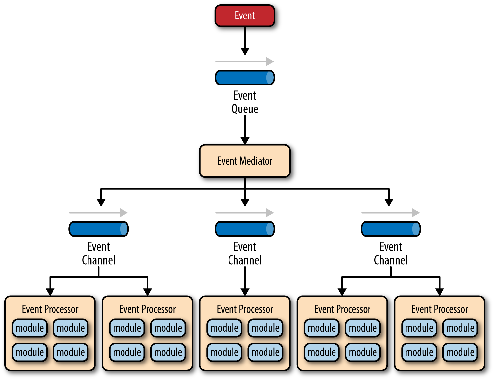
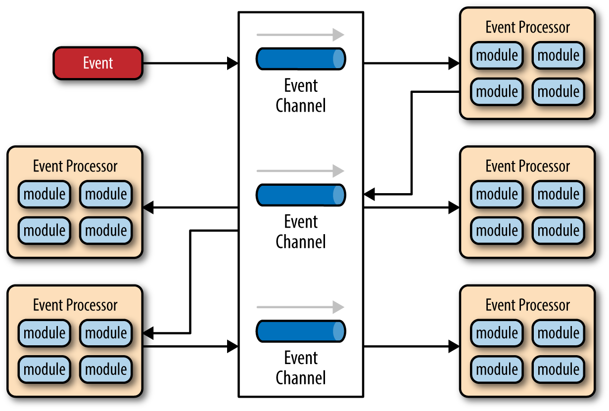

##### Event Driven

+++

- asynchronous
- consists of highly decoupled single-purpose event-processing components
- scalable
- suitable for small...big apps
- two main topologies: **mediator** and **broker**

+++

**Mediator**

Used when you need to orchestrate multiple steps within an event through a central mediator.
Useful for events that have multiple steps and require some level of orchestration to process the event.

+++

```Java
bool handlePayment(Request req) {
  if(!userAuthenticated(req)) return false;
  if(!checkFraud(req)) return false;
  if(!checkCompliance(req)) return false;
  if(!hasEnoughBalance(req)) return false;

  return processPayment(req);
}
```

+++



+++

Components:
- **Event Queue** - transport
- **Event Mediator** - may create new async events which are sent to event channels
- **Event Channel** - message queue or topic
- **Event Processor** - execute specific business logic

+++

**Broker**

Used when you want to chain events together without the use of a central mediator.
Useful when you have relatively simple event processing flow and you don't need central orchestration.

+++



+++

Considerations

- complex to implement, mainly because it is async
- hard to achieve atomic transactions
- hard to maintain event-processor component contracts
