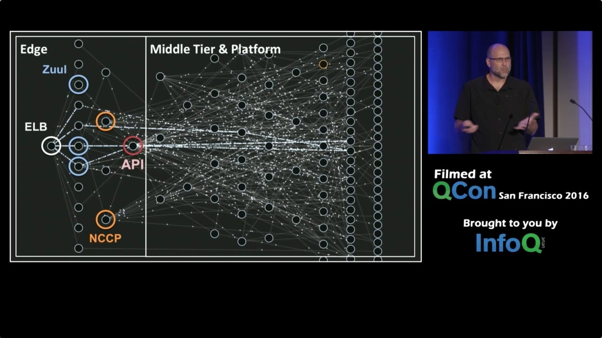

##### Microservices

+++

- **separately deployable units** (services)
- each unit may be written in different language
- distributed architecture
- without a dedicated devops team - this pattern is forbidden

+++

Problems:
- configuration
- service discovery
- logging
- request tracing
- orchestration
- secret management
- circuit breakers
- availability - `99.9% * 99.9% * 99.9% = 97.03%`
- ...

+++

+++

+++

Problems - Solutions:
- configuration - Consul
- service discovery - Consul
- logging - ELK
- request tracing - Zipkin
- orchestration - Docker + k8s/swarm
- secret management - Vault
- circuit breakers - ... ?
- availability - ... ?
- ...

+++

+++

## Examples?
